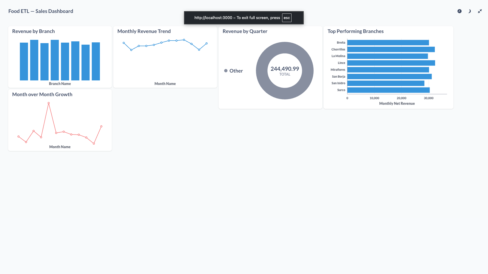
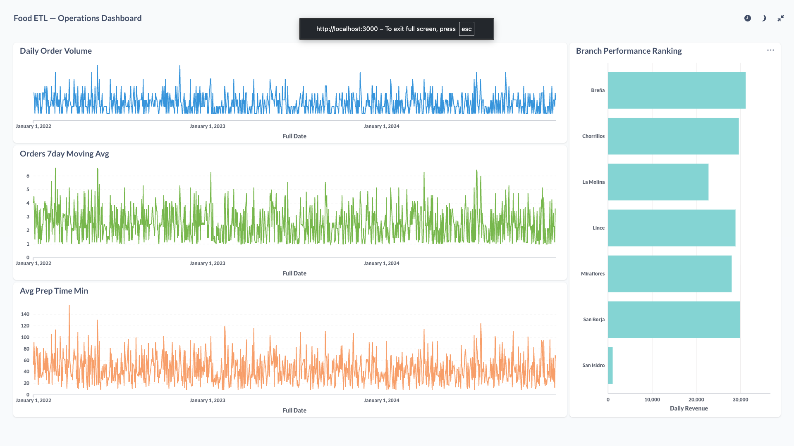
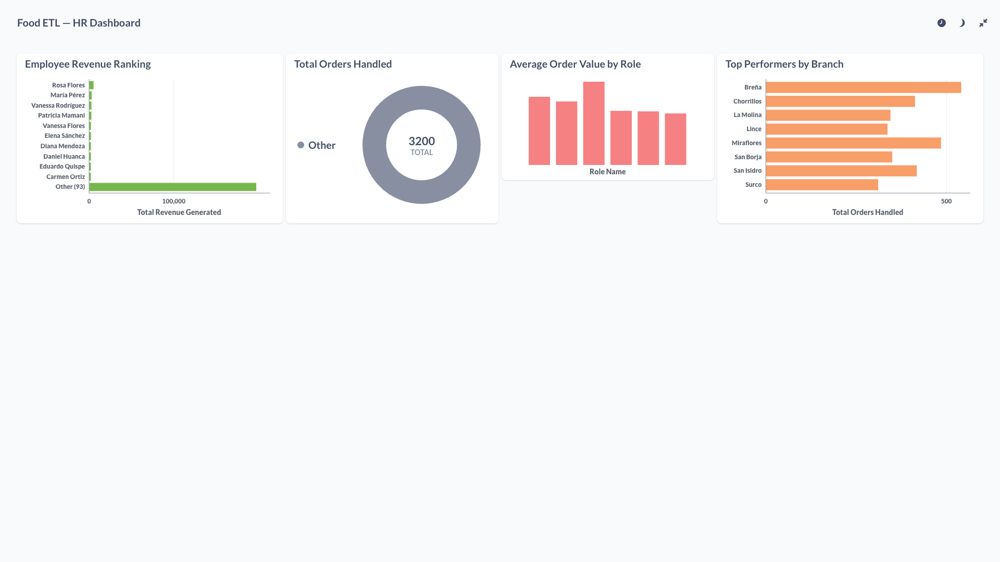

# 🍔 Food ETL Pipeline

An enterprise-grade end-to-end ETL pipeline implementing Kimball dimensional modeling across staging, ODS, star schema, and data mart layers in MySQL — featuring SCD Type 2, idempotent incremental loads, automated data quality auditing, and three Airflow DAG patterns — visualized in Metabase.

---

## 🏗️ Architecture

Kaggle Dataset (Fast Food Sales 2022-2024)
↓
Python + Kaggle API (Extraction)
↓
Staging Layer (MySQL) — Raw data landing zone
↓
ODS Layer (dbt) — Cleaned, standardized, translated
↓
DWH Layer (dbt) — Kimball Star Schema + SCD Type 2
↓
Data Mart Layer (dbt) — Advanced SQL + Window Functions
↓
Airflow (Orchestration) — 3 DAGs
↓
Metabase (Dashboard) — 3 Dashboards

---

## 🛠️ Tech Stack

| Layer            | Tool                          |
| ---------------- | ----------------------------- |
| Data Source      | Kaggle Fast Food Dataset      |
| Extraction       | Python + Kaggle API           |
| Transformation   | dbt                           |
| Loading          | Python + SQLAlchemy + PyMySQL |
| Database         | MySQL 8.0                     |
| Orchestration    | Apache Airflow                |
| Containerization | Docker + Docker Compose       |
| Visualization    | Metabase                      |
| Version Control  | Git + GitHub                  |

---

## 📊 Data Architecture

### Layers

| Layer          | Schema         | Tables                                                |
| -------------- | -------------- | ----------------------------------------------------- |
| Staging        | food_etl       | stg_orders, stg_sales, stg_employees                  |
| ODS            | food_etl_ods   | ods_orders, ods_sales, ods_employees                  |
| DWH Dimensions | food_etl_dwh   | dim_date, dim_restaurant, dim_employee, dim_menu_item |
| DWH Facts      | food_etl_dwh   | fact_orders, fact_sales                               |
| Data Marts     | food_etl_marts | mart_sales, mart_operations, mart_hr                  |

### Star Schema

      dim_date
         |

dim_employee — fact_orders — dim_restaurant
|
dim_menu_item
dim_date
|
dim_restaurant — fact_sales — dim_menu_item

---

## 🔍 Key Concepts Implemented

| Concept                      | Detail                                          |
| ---------------------------- | ----------------------------------------------- |
| Kimball Dimensional Modeling | Staging → ODS → DWH → Marts                     |
| SCD Type 2                   | Valid from/to dates + is_current flag           |
| Surrogate Keys               | Auto-generated integer PKs                      |
| Data Quality                 | 90 dbt tests across all layers                  |
| Window Functions             | SUM, LAG, RANK, ROW_NUMBER, NTILE, PERCENT_RANK |
| CTEs                         | Multi-step transformations                      |
| Idempotent Loads             | Safe to re-run without duplicates               |
| Audit Logging                | Loaded_at timestamps on all tables              |
| Spanish → English            | Full data translation in ODS layer              |

---

## 🚀 Airflow DAGs

| DAG           | Schedule       | Purpose                               |
| ------------- | -------------- | ------------------------------------- |
| dag_extract   | Daily midnight | Downloads Kaggle data + loads staging |
| dag_transform | Daily 1am      | Runs all dbt models layer by layer    |
| dag_quality   | Daily 2am      | Runs all 90 dbt tests                 |

---

## 📈 Metabase Dashboards

### Sales Dashboard



### Operations Dashboard



### HR Dashboard



---

## 🗂️ Project Structure

food-etl-pipeline/
├── airflow/
│ └── dags/
│ ├── dag_extract.py
│ ├── dag_transform.py
│ └── dag_quality.py
├── data/
│ ├── raw/
│ └── processed/
├── dbt/
│ └── food_etl/
│ ├── models/
│ │ ├── staging/
│ │ ├── ods/
│ │ ├── dwh/
│ │ │ ├── dimensions/
│ │ │ └── facts/
│ │ └── marts/
│ ├── snapshots/
│ ├── tests/
│ └── macros/
├── docker/
│ ├── docker-compose.yml
│ ├── Dockerfile.airflow
│ └── init.sql
├── docs/
│ ├── dashboard_sales.png
│ ├── dashboard_operations.png
│ └── dashboard_hr.png
├── extract/
│ └── scripts/
│ ├── extract_kaggle.py
│ ├── explore_data.py
│ └── load_staging.py
├── scripts/
│ └── create_staging.sql
├── .env
├── .gitignore
├── requirements.txt
└── README.md

---

## ⚙️ How to Run

### Prerequisites

- Docker Desktop
- Python 3.11+
- Conda
- Kaggle API key

### Setup

**1. Clone the repository:**

```bash
git clone https://github.com/anirudh010301/food-etl-pipeline.git
cd food-etl-pipeline
```

**2. Create conda environment:**

```bash
conda create -n food_etl python=3.11 -y
conda activate food_etl
pip install -r requirements.txt
```

**3. Configure environment variables:**

```bash
cp .env.example .env
# Edit .env with your Kaggle credentials
```

**4. Start Docker services:**

```bash
cd docker
docker-compose up -d
```

**5. Load data:**

```bash
cd ..
docker exec -i food_etl_mysql mysql -u root -pfood_etl_pass < scripts/create_staging.sql
python extract/scripts/load_staging.py
```

**6. Run dbt:**

```bash
cd dbt/food_etl
dbt run
dbt test
```

**7. Access services:**

| Service  | URL                   | Credentials                       |
| -------- | --------------------- | --------------------------------- |
| Airflow  | http://localhost:8082 | admin / admin                     |
| Metabase | http://localhost:3000 | admin@foodetl.com / food_etl_pass |

---

## 📝 Data Quality

| Layer     | Tests  | Status             |
| --------- | ------ | ------------------ |
| Staging   | 12     | ✅ All passing     |
| ODS       | 23     | ✅ All passing     |
| DWH       | 37     | ✅ All passing     |
| Marts     | 18     | ✅ All passing     |
| **Total** | **90** | ✅ **All passing** |

---

## 👨‍💻 Author

Anirudh Adda
